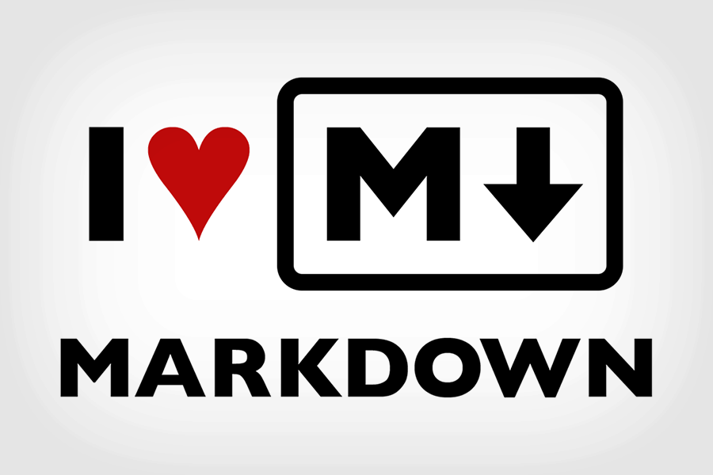
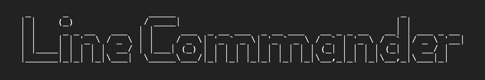
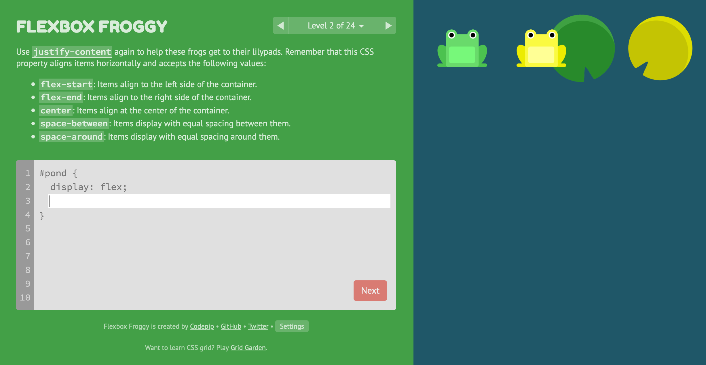
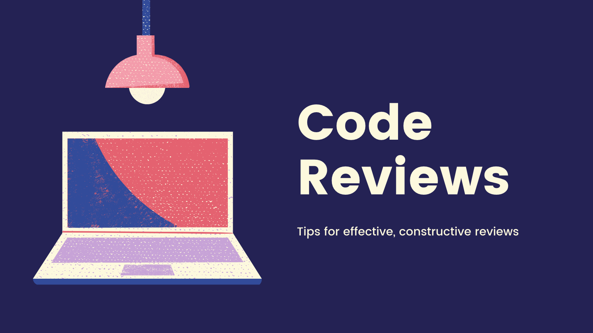

    

<h1 align="center">
  Web Fundamentals 1
</h1>

[Welcome to this theme's video](https://youtu.be/qGl9trMf-3k)

## Overview

Welcome to your first ever resources repo. Here you will find all the links to information and tasks that you will need for your first week of part time study. Each week has a theme, a goal, and a set of resources to help you achieve your goal whilst learning about the theme. This weeks theme, as you may already know, is Web Fundamentals Part 1, and the the goal of this week is to build a website. Along the way we are going to get to grips with our coding environment, learn what on earth the internet even is, ground ourselves in the building blocks of the web and practice working with others.

### This Weeks Objectives

- Get comfortable in our coding environment
- Build our first website
- Host that website using netlify

## Learning Tasks

The following tasks are for you to do in your own time, on your own and with your pair. They all will help you practice the skills necessary for this weeks objectives. Take your time, enjoy the process, and read around each part.

### Intro to the web 💻

What even is the internet? Is it different to the world wide web? How does it actually work? These are things we should know if we are going to start building websites, web apps and projects.

We have selected three videos for you to watch from a series youtube videos that are a whirl wind tour of everything from early computing to machine learning, robots and more! The three videos we would like you to watch are particularly relevant to the area we will be working in. The aim for us here is to gain an overview of how computers talk to each other. This will help us become more informed about what our code is doing. If you like the series then watch more!

- [Computer Networks](https://youtu.be/3QhU9jd03a0)
- [The Internet](https://youtu.be/AEaKrq3SpW8)
- [The World Wide Web](https://youtu.be/guvsH5OFizE)

### Setting up your IDE 🛠

We will be using VS Code to edit all our code. It's light weight, flexible and used widely across the industry. [Watch this video](https://code.visualstudio.com/docs/introvideos/basics) that shows you how to download and get started editing some files!

### Learn HTML and CSS 🖥

Lets get coding! HTML and CSS are two very important languages when it comes to the web. At [marksheet.io](https://marksheet.io/) you will find a tutorial with four sections; Web, HTML, CSS and Sass. Work through the first three sections and we will come back to Sass later in the course. The Web section should should help you embed what you've learnt from the Crash Course Computer Science videos, the HTML and CSS sections are a treasure trove of great information on putting together a website.

Whilst you are going through those tutorials use VS Code to practice, and create a website in this repo that uses what you've learnt to create a simple website. It can be about anything but if you need a starting point them make a website all about your favorite food.

### Avatar Recap 💃

You did enough to get on the course but now you know a little bit more about how things work we'd like you to spruce up your SOC avatar. Now that you know a bit more about HTML and CSS you should understand how it works a bit more. Spend some time getting your avatar as good as you can whilst thinking about how HTML and CSS work together. [Here is the link](application.schoolofcode.io) to the character building. Let us know if you can't remember your login details!

### Learn Markdown ⇣

Markdown is a lightweight markup language designed to make it easy to write for the web. You can read more about the [philosophy here](https://daringfireball.net/projects/markdown/syntax#philosophy). For us, it will really come in handy when writing documentation about our code and communicating on GitHub within issues and pull requests. It is also used by a lot of bloggers to create content. for instance if you wanted to write a blog post on [dev.to](https://dev.to/) then you will use markdown.

To learn markdown [follow this tutorial](https://www.markdowntutorial.com/), then in your website repo, add to the `README.md` file a section on what you have learnt about HTML, CSS and the web. Mark it up `_nicely_`.

### Googling effectively

The life of a programmer is a life of searching. Searching for meaning, belonging and acceptance but most importantly how to solve the current problem you have with your code! The skill of articulating your question, knowing what is specific to you and what is relevant to others, and navigating different answers on the web is something that you need to practice. Be patient, considered and in time you will feel like you can conquer any challenged you are faced with by breaking down the problem, researching and building together answers from different places.

Code wise there are a few places that you will find yourself going to frequently:

**Google**

Google is the gateway to a billion solutions. Learn to google well. [Learn how to refine your search](https://support.google.com/websearch/answer/2466433).

**Stack Overflow**

Stack Overflow is a forum where developers can ask questions and other developers will answer. These questions and answers are then there for other people to learn from, vote on the best solutions and update when things change. Have a look at this post asking about [the role attribute](https://stackoverflow.com/questions/10403138/what-is-the-purpose-of-the-role-attribute-in-html). If you have questions like this, search first and the the answer with probably already be on stack overflow. If it's not, then you can ask it (using your new markdown skills to style your post)!

**Documentation**

For HTML and CSS there are two main places where the specifics of how they work are documented; [w3schools](https://www.w3schools.com/) and [MDN (mozilla developer network) Web Docs](https://developer.mozilla.org/). Both are excellent and have both reference material as well as tutorials. Often in your searches you will find links to similar content on both sites (for example if we search for ["style attribute"](https://www.google.com/search?q=style+attribute)). When you in this situation, have a read though the articles you find and see what they have in common. w3schools tends to be a little more beginner friendly but you be using both for years to come!

Later in the course we will be building on our foundations and using libraries of code that other people have written. Learning to navigate technical documentation is a key skill of a professional developer.

### The Browser 🔥🦊

#### Dev Tools

The code we are writing is running in a browser. And now that you are developer you can use the browser for much more than just browsing the web, you can get your hands dirty and get into the nitty gritty of what makes up a website. [Follow this tutorial](https://zapier.com/blog/inspect-element-tutorial/) to learn about how and why you might want to take the blue pill and see whats _really_ going on.

#### Different Browsers

On the course we recommend using either [chrome](https://www.google.com/intl/en_uk/chrome/) or [firefox](https://www.mozilla.org/en-GB/firefox/new/) but the choice is yours. In fact you'll probably want to use a mixture of both and some other browsers too. This is because each browser has its own quirks when interpreting a website, we want to be able to write code that works well in all of them. [Read this article](https://developer.mozilla.org/en-US/docs/Learn/Tools_and_testing/Cross_browser_testing/Introduction) to get an overview of cross browser testing. We'll dig more into this late in the course.

### Version Control 🤓

As you know from the live session, git is a wonderful tool to help us track changes in our code and collaborate with others. To embed what you learned, [follow this git for beginners tutorial](https://product.hubspot.com/blog/git-and-github-tutorial-for-beginners). Use [this cheat sheet](https://education.github.com/git-cheat-sheet-education.pdf) to help you remember the commands and at some point when once things get complicated you can [use this site](https://dangitgit.com/en) to help you fix common mistakes.

### Line Commander 💂‍♀️

Learning to navigate a computer using the command line is a skill that gives you lots of power. It will also make you feel like a hacker in a movie. There are a few basic commands to learn first and a lot of more complex ones to learn later on. The important thing for you to take away is the pattern of a using a command, options and input.

We have put together this challenge which should help you get to grips with the basics and also so dome cool stuff! We would like you to do this in your pair. We think you should both download the activity folder and work through it at the same time. Take in in turns to share your screens and every time you make it to the next level switch who is sharing. It's important to stay together so don't race ahead of your partner, remember you are a team.

[Line Commander Challenge](https://schoolofcode.github.io/line-commander/)

### CSS Games 🐸🌻

In the `marksheet.io` tutorial you learnt about css selectors. Take in in turns to share screen as you work your way through this css selector challenge: [css diner](https://flukeout.github.io/)

The next two games are about css properties that help us layout sections of our websites, or indeed our whole page. Get fantastic at flex box using [flex box froggy](https://flexboxfroggy.com/), a get good at grid with [grid garden](https://cssgridgarden.com/)

### Code Reviews 👨‍💻👩‍💻

Code reviews are an important part of working in a dev team and by the end of the course will become second nature. During this first week ask for a code review from the other pair in your team (see below). They should also ask for a code review from you. Spend some time in your pair reading through their code and ask questions you have and make any comments you think necessary. [Here you can find the presentation about code reviews to help you](https://www.canva.com/design/DAEZyid3JlU/UWiz-Z0aGCQ2iapSsJiLog/view?utm_content=DAEZyid3JlU&utm_campaign=designshare&utm_medium=link&utm_source=publishsharelink).

## Groups and Pairs

Below you will find the pairs and teams for this week. Your pair will be the person you see the most but keep in touch with your team throughout the week. Ask them how they are getting on and use them as your first port of call if you are stuck on something.

**Things to do**

- Set up a group chat as your team
- Review the other pair's code
- Work around each others schedules
- Be inclusive and have fun!

Pairs for Week 1

| Pair | Team |                                   |
| ---- | ---- | --------------------------------- |
| 1    | 1    | Tom Walker & Gurmukh Chandan      |
| 2    | 1    | Rebecca Floyd & Sara Mohamoud     |
| 3    | 2    | Sellanni McKenzie & Jamie Hannah  |
| 4    | 2    | Amina Muhammad & Toby Smith       |
| 5    | 3    | Rumaanah Ellahi & Emilio Comiling |
| 6    | 3    | Lewis Murray & Catherine Butler   |
| 7    | 4    | Kate Harrison & Alina Savin       |
| 8    | 4    | Becks Maybury & Nancy Echefu      |
| 9    | 5    | Kelly Ryan & Muna Fidow           |
| 10   | 5    | Wiktor Nowicki & Merlin Jones     |
| 11   | 6    | Helena Archer & Jack Browne       |
| 12   | 6    | Maryam Dar & Yonis Elmi           |
| 13   | 7    | Clarisse Leduc & Jubair Ahmed     |
| 14   | 7    | Natalie Pinnock & Ines Perez      |
| 15   | 8    | Rachel Haynes & Umar Begg         |
| 16   | 8    | Asfand Khan & Amdadur Rahman      |
| 17   | 9    | Tania Yeromiyan & Jade Phipps     |
| 18   | 9    | Claudiu Manta & Shola Quadri      |
| 19   | 10   | Yasmin Mohamud & Jordan Linton    |
| 20   | 10   | Ryan Brown & Gemma Whitfield      |

### Checkpoint Challenge ✅

Your first checkpoint challenge is to make a website all about your partner. This site will be a profile representing your partner to the rest of the group. As we said on Saturday, you should interview your partner to find out all the information you need and how they think their profile should be. You should also use your own judgment as to what the rest of the cohort would find interesting.

Follow this link and accept the GitHub classroom assignment. This will create a repo within the School of Code organisation for you to use. This will help us check up on how everyone is doing!
